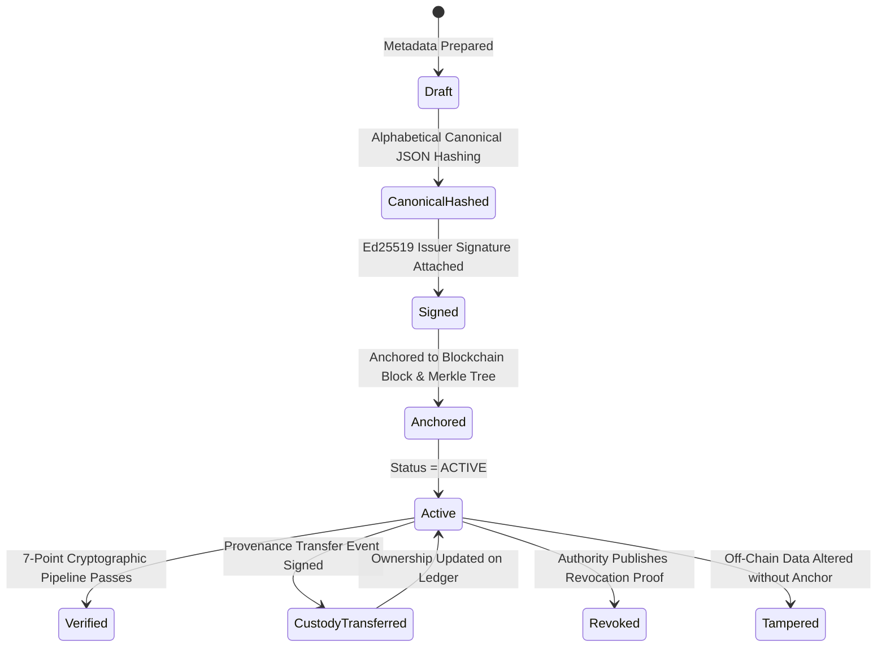
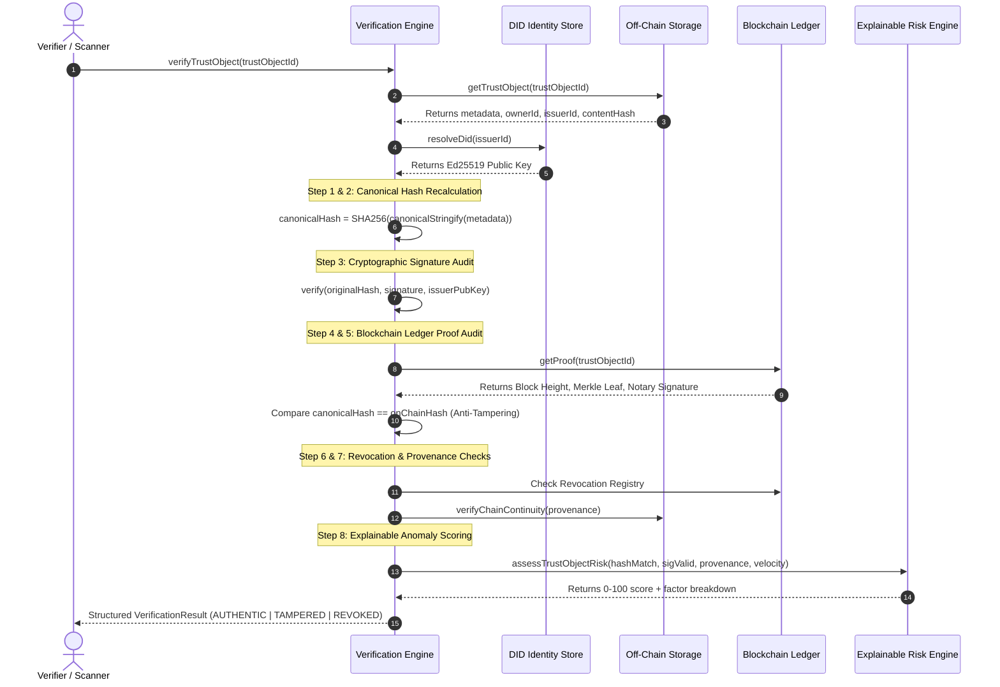

# TRUSTGRID System Architecture & Technical Specifications
> **Smart India Hackathon 2026 — Problem Statement 26194**

---

## 1. High-Level Conceptual Architecture

```
┌───────────────────────────────────────────────────────────────────────────┐
│                           TRUSTGRID CLIENT UI                             │
│      [Hero Verification]   [Trust Graph]   [Trust Passport]  [Explorer]    │
└─────────────────────────────────────┬─────────────────────────────────────┘
                                      │ REST API / JSON-RPC
┌─────────────────────────────────────▼─────────────────────────────────────┐
│                          TRUSTGRID PROTOCOL CORE                          │
│                                                                           │
│   ┌───────────────────────────────────────────────────────────────────┐   │
│   │                    Trust Object Protocol (TOP)                    │   │
│   │   • Universal Schema       • Canonical JSON SHA-256 Hashing       │   │
│   │   • Ed25519 Signatures     • 7-Point Unified Verification Engine  │   │
│   └───────────────────────────────┬───────────────────────────────────┘   │
│                                   │                                       │
│   ┌───────────────────────────────┼───────────────────────────────────┐   │
│   │                               │                                   │   │
│   ▼                               ▼                                   ▼   │
│ ┌──────────────┐          ┌──────────────┐                    ┌─────────┐ │
│ │ Identity     │          │ Risk Engine  │                    │ Trust   │ │
│ │ W3C DIDs     │          │ 0-100 Anomaly│                    │ Graph   │ │
│ │ Ed25519 Keys │          │ Explainable  │                    │ Service │ │
│ └──────────────┘          └──────────────┘                    └─────────┘ │
└───────────────────────────────────┬───────────────────────────────────────┘
                                    │
           ┌────────────────────────┴────────────────────────┐
           ▼                                                 ▼
┌───────────────────────────────┐         ┌─────────────────────────────────┐
│     OFF-CHAIN DATA STORE      │         │     BLOCKCHAIN TRUST SUBSTRATE  │
│  (Zero private data on-chain) │         │   (Only hashes, proofs & state) │
│ • SQLite (Native Dev)         │         │                                 │
│ • PostgreSQL (Production)     │         │ ┌─────────────────────────────┐ │
│ • Encrypted Document Vault    │         │ │ Consortium Notary Ledger    │ │
│ • Normalised Relational DDL   │         │ │ (In-Process Dev Substrate)  │ │
│                               │         │ └──────────────┬──────────────┘ │
│                               │         │                │ Swappable      │
│                               │         │ ┌──────────────▼──────────────┐ │
│                               │         │ │ Hyperledger Fabric Multi-Org│ │
│                               │         │ │ (Enterprise Production)     │ │
│                               │         │ └─────────────────────────────┘ │
└───────────────────────────────┘         └─────────────────────────────────┘
```

---

## 2. The Trust Object Protocol (TOP) Lifecycle

Every Trust Object progresses through a rigorous, non-repudiable cryptographic lifecycle:



---

## 3. The 7-Point Cryptographic Verification Sequence



---

## 4. Blockchain Substrate Abstraction Layer

The system uses a clean `BlockchainAdapter` interface:

```typescript
export interface BlockchainAdapter {
  name: string;
  networkType: 'CONSORTIUM_LEDGER' | 'HYPERLEDGER_FABRIC';
  registerProof(params: ...): Promise<BlockchainProof>;
  verifyProof(trustObjectId: string, expectedHash: string): Promise<ProofVerificationResult>;
  revokeProof(params: ...): Promise<BlockchainProof>;
  addProvenanceEvent(event: ProvenanceEvent): Promise<{ txId: string; blockHeight: number }>;
  getProof(trustObjectId: string): Promise<BlockchainProof | null>;
  getTransaction(txId: string): Promise<BlockchainTransaction | null>;
  getAuditLedger(): Promise<Block[]>;
  verifyLedgerIntegrity(): Promise<{ valid: boolean; totalBlocks: number; verifiedTxs: number }>;
}
```

### Implementations:
1. **`ConsortiumBlockchainAdapter` (MVP Substrate):**
   * Computes SHA-256 sequential blocks chained via `previousHash`.
   * Calculates binary Merkle tree roots for transaction batches.
   * Endorsed with Ed25519 validator signatures from `did:trustgrid:sys:consortium-notary`.
   * Real, mathematically auditable ledger running locally without external daemons.
2. **`ProductionBlockchainAdapter` (Enterprise Substrate):**
   * Implements the exact same interface over **Hyperledger Fabric** gRPC gateway using channel chaincode (`top-cc`).
   * Zero lines of application or sector logic require changing to transition between environments.

---

## 5. Dual-Mode Database Architecture

TRUSTGRID enforces normalized schema design instead of dumping unstructured JSON into single tables:
* `organizations`, `users`, `identities`
* `trust_objects`, `credentials`, `documents`
* `provenance_events`, `ownership_events`, `revocations`
* `blockchain_transactions`, `blockchain_blocks`, `audit_logs`
* `security_events`, `risk_events`, `verification_events`

### Dual Runtime Drivers:
1. **Local Dev / SIH Evaluation:** Built-in synchronous SQLite (`node:sqlite`), creating `trustgrid.db` automatically with foreign key cascading and indexed queries.
2. **Production Container:** ANSI-compliant PostgreSQL schema migrations located in `src/database/schema.sql` and deployed via `docker-compose.yml`.

---

## 6. Sector Extensibility Model

New economic domains (e.g. Healthcare, Carbon Credits, Real Estate) register a lightweight `SectorModule`:
* Implements `SectorModule` interface
* Defines metadata validation rules
* Uses `TrustObjectService` for minting and `VerificationService` for auditing
* Zero modification to core blockchain or cryptography services is required.
